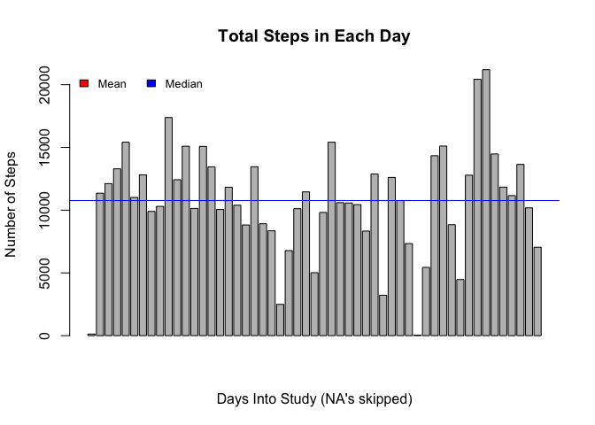

# Reproducible Research: Peer Assessment 1
K. Grace Kennedy  


## Loading and preprocessing the data

###Variable description and initial data load

```r
options(scipen=999)#Gets rid of scientific notation
setwd("~/Dropbox/0Coursera_DataAnalysisR/5ReproducibleResearch/Projects/Project1ActivityMonitor/RepData_PeerAssessment1/Rcode")
rawdata=read.csv("../activity.csv")
head(rawdata)
```

```
##   steps       date interval
## 1    NA 2012-10-01        0
## 2    NA 2012-10-01        5
## 3    NA 2012-10-01       10
## 4    NA 2012-10-01       15
## 5    NA 2012-10-01       20
## 6    NA 2012-10-01       25
```

The variables included in the original dataset are:  
**steps** (Class: integer): The number of steps in the time interval  
**date** (Class factor):  Date of the observation  
**interval** (Class: factor):  Start of 5-minute time interval from 0 (midnight) to 2355 (11:55PM)

###Tagging observations with day fo the week and day type

For future analysis, we want to be able to call observations by day of the week and by whether or not it is a weekday or weekend.  The last part of the following code (last `else` section) is checking that the assignment of weekday/weekend ran well.  It keeps track of any unassigned observations to be printed after the code chunk.


```r
rawdata[[2]]=as.Date(rawdata[[2]])
dayOfWk=as.factor(weekdays(rawdata[[2]]))
data=data.frame(rawdata,dayOfWk)
weekdays=c("Monday","Tuesday","Wednesday","Thursday","Friday")
weekend=c("Saturday","Sunday")
k=1
x=c("All days were classified as weekday or weekend.")
check=x
for (i in 1:length(data[[1]])){
        if (data$dayOfWk[i] %in% weekdays){
                data[i,5]="weekday"
        } else if (data$dayOfWk[i] %in% weekend) {
                data[i,5]="weekend"
        } else {
                check=x
                x[k]=data[i,4]
                k=k+1
                if (check!=x){
                        check=c("There were days of the week that did 
                                not get identified as weekend or weekday. 
                                 Check the variable x.")
                }
        }
}
data[[5]]=as.factor(data[[5]])
names(data)[5]="dayType"
head(data)
```

```
##   steps       date interval dayOfWk dayType
## 1    NA 2012-10-01        0  Monday weekday
## 2    NA 2012-10-01        5  Monday weekday
## 3    NA 2012-10-01       10  Monday weekday
## 4    NA 2012-10-01       15  Monday weekday
## 5    NA 2012-10-01       20  Monday weekday
## 6    NA 2012-10-01       25  Monday weekday
```

All days were classified as weekday or weekend.  The new variables are  
**date** (Updated to Class: Date)  
**dayOfWk** (Class: factor)  
**dayType** (Class: factor)  

## What is mean total number of steps taken per day?

For this question we do not consider missing values.


```r
steppingDays=data[!is.na(data$steps),]
stepsByDay=aggregate(steppingDays$steps,by=list(Date=steppingDays$date),sum)
```

Statistic     | Value         | Code   
------------- | ------------- | -------------  
Mean  | 10766.19  | `round(mean(stepsByDay[[2]]),digits=2)`
Median  | 10765   | `median(stepsByDay[[2]])`

The mean and the median are so close relative to the range of steps in a day that we cannot distinguish them on the histogram below.  


```r
par(mfrow=c(1, 1), mar=c(5, 4, 2, .8))
hist(stepsByDay[[2]],
     main="Total Steps in a Day",
     xlab="Steps per Day",
     ylab="Number of Days",
     )
legend("topright",
       legend=c("Mean","Median"),
       fill=c("red","blue"))
abline(
        v=c(mean(stepsByDay[[2]]),median(stepsByDay[[2]])),
        col=c("red","blue")
)
```

 

A barplot would show us the number of steps for each individual day rather than a histogram of the total of number of steps per day, which gives us a sense for the distribution for the total number of steps per day.  The individual bars are ordered by rows, not necessarily chronologically.  So we need to check that the observations are actually in chronological order, which they are.  However there are definitely days for which no data was recorded.


```r
!is.unsorted(stepsByDay[[1]])
```

```
## [1] TRUE
```

```r
length(unique(steppingDays[[2]]))==length(unique(data[[2]]))
```

```
## [1] FALSE
```


```r
barplot(stepsByDay[[2]],
     main="Total Steps in Each Day",
     xlab="Days in the Study (NA's skipped)",
     ylab="Number of Steps",
)
legend("topleft",
       horiz=TRUE, bty='n', 
       cex=0.8,
       legend=c("Mean","Median"),
       fill=c("red","blue"))
abline(
        h=c(mean(stepsByDay[[2]]),median(stepsByDay[[2]])),
        col=c("red","blue")
)
```

 

## What is the average daily activity pattern?

We need to get a new data set that has the average time for each time interval, and plot the results.  You will need to install the Hmisc package to run the following chunk of code with `install.packages("Hmisc")` if you haven't already.  Then it must be loaded each time with `library(Hmisc)` (hidden here).


```r
dayPatterns=aggregate(steppingDays[1],by=list(interval=steppingDays$interval),mean)
plot(dayPatterns,
     type="l",
     xaxt="n",
     xlab="24 Hour Time",
     ylab="Average Number of Steps per 5 Minute Interval",
     main="Average Daily Activity Pattern"
     )
axis(side=1,
     at=seq(0,2300,by=600)
     )
minor.tick(nx=5, tick.ratio=.5)
```

 


## Inputing missing values
I decided to fill in the missing values using the average of the days of the week that are present to avoid bias such as the individual running on certain days of the week or walking to work.  The number of each type of day that is missing is below:


```r
naData=data[is.na(data[[1]]),]
summary(naData$dayOfWk)/(24*60/5)
```

```
##    Friday    Monday  Saturday    Sunday  Thursday   Tuesday Wednesday 
##         2         2         1         1         1         0         1
```

```r
summary(naData$dayType)/(24*60/5)
```

```
## weekday weekend 
##       6       2
```

```r
dataByDays=aggregate(steppingDays$steps,by=list(dayOfWk=steppingDays$dayOfWk,interval=steppingDays$interval),mean)
newData=data
for (i in 1:length(newData[[1]])){
        if (is.na(newData$steps[i])){
                newData$steps[i]=
                        dataByDays[dataByDays$dayOfWk==newData$dayOfWk[i] 
                                   & dataByDays$interval==newData$interval[i],3]
        }
}
head(newData)
```

```
##      steps       date interval dayOfWk dayType
## 1 1.428571 2012-10-01        0  Monday weekday
## 2 0.000000 2012-10-01        5  Monday weekday
## 3 0.000000 2012-10-01       10  Monday weekday
## 4 0.000000 2012-10-01       15  Monday weekday
## 5 0.000000 2012-10-01       20  Monday weekday
## 6 5.000000 2012-10-01       25  Monday weekday
```

Now we aggregate our steps by day using our dataset with NA's filled in to create a new histogram of our data.  We see from the table below that the mean and median are slightly higher when we extrapolate data for the missing values.


```r
stepsByDayNEW=aggregate(newData$steps,by=list(Date=newData$date),sum)
```


```r
par(mfrow=c(1,2),oma=c(0,0,2,0))
hist(stepsByDay[[2]],
     main="NA's Removed",
     xlab="Steps per Day",
     ylab="Number of Days",
)
hist(stepsByDayNEW[[2]],
     main="Extrapolated NA Values",
     xlab="Steps per Day",
     ylab="Number of Days",
)
title(main="Total Steps in a Day", outer=T)
```

 


 Statistic     | Value         | Code   
------------- | ------------- | -------------  
Mean (NA's removed)  | 10766.19  | `mean(stepsByDay[[2]])`
Median (NA's removed)  | 10765   | `median(stepsByDay[[2]])`
Mean (NA's Extrapolated)  | 10821.21  | `mean(stepsByDayNEW[[2]])`
Median (NA's Extrapolated)  | 11015   | `median(stepsByDayNEW[[2]])`


## Are there differences in activity patterns between weekdays and weekends?
