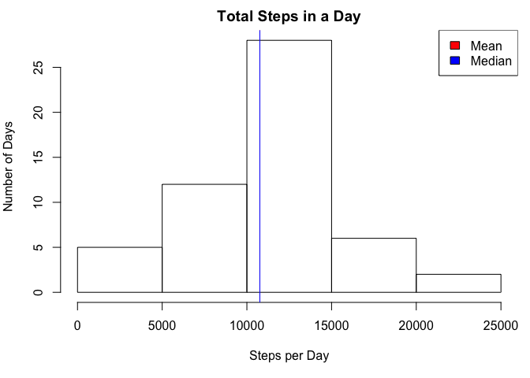

# Reproducible Research: Peer Assessment 1
K. Grace Kennedy  


## Loading and preprocessing the data

###Variable description and initial data load

```r
setwd("~/Dropbox/0Coursera_DataAnalysisR/5ReproducibleResearch/Projects/Project1ActivityMonitor/RepData_PeerAssessment1/Rcode")
rawdata=read.csv("../activity.csv")
head(rawdata)
```

```
##   steps       date interval
## 1    NA 2012-10-01        0
## 2    NA 2012-10-01        5
## 3    NA 2012-10-01       10
## 4    NA 2012-10-01       15
## 5    NA 2012-10-01       20
## 6    NA 2012-10-01       25
```

The variables included in the original dataset are:  
**steps** (Class: integer): The number of steps in the time interval  
**date** (Class factor):  Date of the observation  
**interval** (Class: factor):  Start of 5-minute time interval from 0 (midnight) to 2355 (11:55PM)

###Tagging observations with day fo the week and day type

For future analysis, we want to be able to call observations by day of the week and by whether or not it is a weekday or weekend.  The last part of the following code (last `else` section) is checking that the assignment of weekday/weekend ran well.  It keeps track of any unassigned observations to be printed after the code chunk.


```r
dates=as.Date(rawdata[[2]])
dayOfWk=as.factor(weekdays(dates))
data=data.frame(rawdata,dayOfWk)
weekdays=c("Monday","Tuesday","Wednesday","Thursday","Friday")
weekend=c("Saturday","Sunday")
k=1
x=c("All days were classified as weekday or weekend.")
check=x
for (i in 1:length(data[[1]])){
        if (data$dayOfWk[i] %in% weekdays){
                data[i,5]="weekday"
        } else if (data$dayOfWk[i] %in% weekend) {
                data[i,5]="weekend"
        } else {
                check=x
                x[k]=data[i,4]
                k=k+1
                if (check!=x){
                        check=c("There were days of the week that did 
                                not get identified as weekend or weekday. 
                                 Check the variable x.")
                }
        }
}
names(data)[5]="dayType"
head(data)
```

```
##   steps       date interval dayOfWk dayType
## 1    NA 2012-10-01        0  Monday weekday
## 2    NA 2012-10-01        5  Monday weekday
## 3    NA 2012-10-01       10  Monday weekday
## 4    NA 2012-10-01       15  Monday weekday
## 5    NA 2012-10-01       20  Monday weekday
## 6    NA 2012-10-01       25  Monday weekday
```

All days were classified as weekday or weekend.  The new variables are  
**dayOfWk** (Class: factor)  
**dayType** (Class: character)  

## What is mean total number of steps taken per day?

For this question we do not consider missing values.


```r
steppingDays=data[!is.na(data$steps),]
stepsByDay=aggregate(steppingDays$steps,by=list(Date=steppingDays$date),sum)
```

Statistic     | Value         | Code   
------------- | ------------- | -------------  
Mean  | 1.0766189\times 10^{4}  | `mean(stepsByDay[[2]])`
Median  | 10765   | `median(stepsByDay[[2]])`


```r
par(mfrow=c(1, 1), mar=c(5, 4, 2, .8))
hist(stepsByDay[[2]],
     main="Total Steps in a Day",
     xlab="Steps per Day",
     ylab="Number of Days",
     )
legend("topright",
       legend=c("Mean","Median"),
       fill=c("red","blue"))
abline(
        v=c(mean(stepsByDay[[2]]),median(stepsByDay[[2]])),
        col=c("red","blue")
)
```

 

## What is the average daily activity pattern?


## Imputing missing values


## Are there differences in activity patterns between weekdays and weekends?
